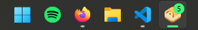

# use-app-badge

Cross-browser wrapper for Navigator Badge API

Wraps the [Badging API](https://developer.mozilla.org/en-US/docs/Web/API/Badging_API)
into an cross-browser set of utilities for easier feature detection
and a more consistent behaviour between browsers.



## Features

- TypeScript support
- Core bundle size under 1.3kB bytes GZipped
- `setAppBadge` and `clearAppBadge` throw errors if webapp is not installed or running in an insecure context
- Safely detect and fallback on unsupported browsers using `isAppBadgeSupported` method

## Installation

**pnpm**

```pnpm
pnpm add use-app-badge
```

**Yarn**

```yarn
yarn add use-app-badge
```

**npm**

```npm
npm install use-app-badge
```

## Usage

```tsx
import { AppBadge, useAppBadge } from 'use-app-badge'

const App = () => {
  const {
    set,
    clear,
    count,
    countAsNumber,
    isSupported,
    isAllowed,
    requestPermission
  } = useAppBadge()
  /*
    Or to enable custom favicon badge
    when Badge API is unavailable, pass favIcon options.
    This will load an additional module ~850 kB GZipped

    const { icon, ...rest } = useAppBadge({ favIcon: { src: './favico.ico' } })
  */
  return (
    <>
      <button
        className="text-accent cursor-pointer"
        onClick={() => { 
          const request = async () => {
            const hasPermission = await requestPermission()
            console.log(
              hasPermission ? 
                'Browser has Badge API permission' 
              : 'Browser is missing Badge API permission or unsupported'
            )
          }
          void request()
        }}
      >
        Request permission
      </button>
      <button
        className="text-accent cursor-pointer"
        onClick={() => void set(countAsNumber + 1)}
      >
        Increment badge count
      </button>
      <button
        className="text-accent cursor-pointer"
        onClick={() => void set()}
      >
        Set active badge
      </button>
      <button
        className="text-accent cursor-pointer"
        onClick={() => void clear()}
      >
        Clear badge
      </button>
      <div>Supported: {isSupported() ? 'yes' : 'no'}</div>
      {/* Or set imperatively via AppBadge Component */}
      {/* <AppBadge count={5} /> */}
    </>
  )
}
```

## Reference

### useAppBadge()

**Arguments**

```tsx
{
  favIcon?: {
    src: string
    badgeColor?: string
    textColor?: string
    badgeSize?: number
    updateMeta?: boolean;
  }
}
```

If the `favIcon` prop is passed, it requires
a `src` value that points to a valid icon 
file from the root of the app domain.

Doing this will generate a `icon` prop data
can be used to update the `meta` tag with.  
Alternatively `updateMeta` will attempt to do this automatically.

- `src: string` - URL path of the icon file
- `badgeColor?: string` - Hex color of the badge, defaults to MacOS style red badge.
- `textColor?: string` - Hex color of text, defaults to white.
- `badgeSize?: string` - Size of the badge in pixels relative to the 32px canvas, defaults to `18`
- `updateMeta?: boolean` - If the hook should update the `meta` tag with the new icon, defaults to `true`

#

**Return Values**


```tsx
count: number | true
```

The current app badge indicator status
- Set to `0` if unset
- Set to `true` if set without a value
- Otherwise set as the notification count as a number

#

```tsx
countAsNumber: number
```

The current app badge indicator status as a number
- Set to `0` if unset
- Set to `1` if set without a value or the count is `1`
- Otherwise set as the notification count as a number

#

```tsx
icon: string
```

The generated favicon with the current badge indicator as
a Base64 data PNG string or URL path
- Set to an empty string if `favIcon` prop not passed
- Set to file src if badge is unset
- Otherwise set as a Base64 generated data string with the badge status baked-in

#

```tsx
set(contents?: number) => Promise<void> // throws DOMException
```

Sets the app badge icon on the associated installed
app either on the dock or taskbar.  If no
value is passed, only a indicator dot will be shown.
Otherwise the notification count is displayed.

In-order for this method to work:
- The webpage must be installed as an app.
- Running over a secure-context (HTTPS).
- Granted notification permission with `requestPermission()` (for Safari iOS) 
  or enabled in the app settings (for MacOS Safari). 

This method will resolve if set successfully or throw an error if:
- The webpage is not installed as an app.
- The webpage is running in an insecure-context (HTTP).
- The browser does not support API.
- Permission was not granted (Safari)

#

```tsx
clear() => Promise<void> // throws DOMException
```

Clears the app badge icon on the associated installed
app either on the dock or taskbar.

In-order for this method to work:
- The webpage must be installed as an app.
- Running over a secure-context (HTTPS).
- Granted notification permission with `requestPermission()` (for Safari iOS) 
  or enabled in the app settings (for MacOS Safari).

This method will resolve if set successfully or throw an error if:
- The webpage is not installed as an app.
- The webpage is running in an insecure-context (HTTP).
- The browser does not support API.
- Permission was not granted (Safari).

#

```tsx
isSupported() => boolean
```
Queries if the app badge is supported.

This method will check that:
- The browser supports the badge API.
- The webpage is running over a secure-context (HTTPS).
- The webpage is running & installed as an app.

However this method does not check if the permission 
to display the badge was granted (Safari only).
In-order to do this call `isAllowed()`.

#

```tsx
isAllowed() => boolean // throws Error
```
Queries if the app badge has been granted permission.
- If the app badge is not supported, `'denied'` is returned.
- If the webpage Chromium based, no permission is needed and `'granted'` is returned.
- Otherwise the browser requires permission and `'unknown'` is returned.
 
  In this case `requestPermission()` should be called.
  Alternatively `navigator.permissions.query({ name: 'notifications' })` can be called
  if you only want to query the status without prompting but `requestPermission()` does
  this prior to prompting.

#

```tsx
requestPermission() => Promise<boolean>
```
Queries if the app badge needs permission or has been granted permission.

If permission is needed, it will prompt for the user to provide the permission.
- `false` is returned if the app badge is not supported or the method could not obtain permission.
  This can happen if the user denies the prompt or has it blocked.
- `true` is returned if the app badge does not require any permission 
   or if it succesfully obtained permission.

## \<AppBadge /\>

Using this `AppBadge` component API allows the badge value to be set imperatively.
This is useful if you have an existing piece of state you want to sync with.

**NOTE:** This API does not offer a way to request permission for Safari.  If you
want to do this, you can use the hook alongside the component.  However
if `favIcon` is set on one API, it should be dropped from the other to avoid having clashes.

```tsx
const App = () => {
  const { requestPermission } = useAppBadge()
  const [unread, setUnread] = useState(5)
  return (
    <>
      <AppBadge count={count} favIcon={{ src: './favicon.ico' }}/>
      <button onClick={() => void requestPermission()}>Request permission</button>
    </>
  )
}
```

**Props**

```tsx
count: number
```

The value that the app badge should be set to.

#

```tsx
favIcon?: FavIcon
```

Options for the favicon generation if the Badge API is unavailable.
See the above options.

#